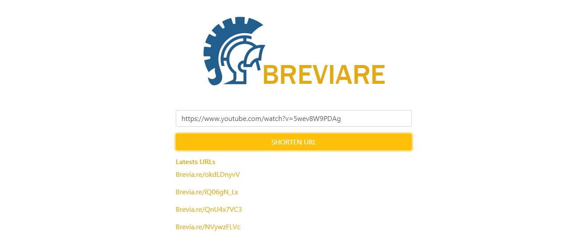

# Breviare

Breviare is a minimalist URL shortener made in Javascript (NodeJS / ExpressJS / MongoDB / Ajax).



## Config

Install all the dependencies with
```
npm install
```

For it to works properly, it is recommended to create a config.js file in the root directory that contains the db connection

```javascript
var config = {};

config.dbconnection = 'dbconnectionurl';

module.exports = config;
```
## Demo

You can try it here, please remember that an url shortener deppends on the url and this domain is a free one provided by Heroku.

https://boiling-dawn-44625.herokuapp.com/
